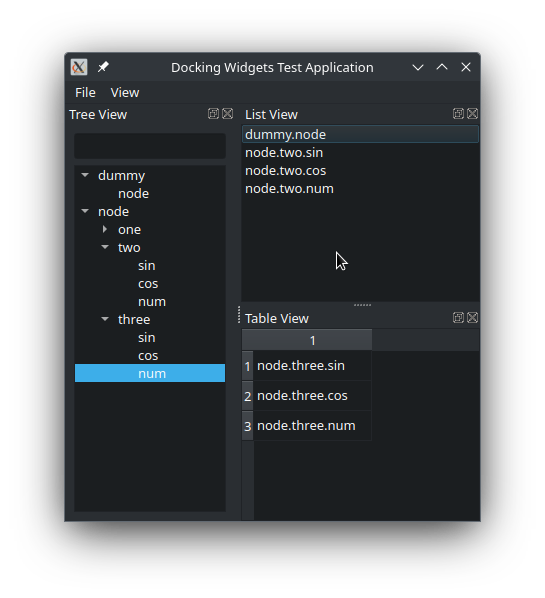

# Docking Widgets Test Application

Application with three docked widgets:
* A tree view, with a line edit filter
* A list view
* A table view

Each of the three views have instances of a [DragDropItemModel](https://github.com/pedrolcl/simple-drag-drop) class, 
and the user can drag-and-drop items from the tree view to the other two views.

Copyright (c) 2023, Pedro López-Cabanillas

SPDX-License-Identifier: BSD-3-Clause
